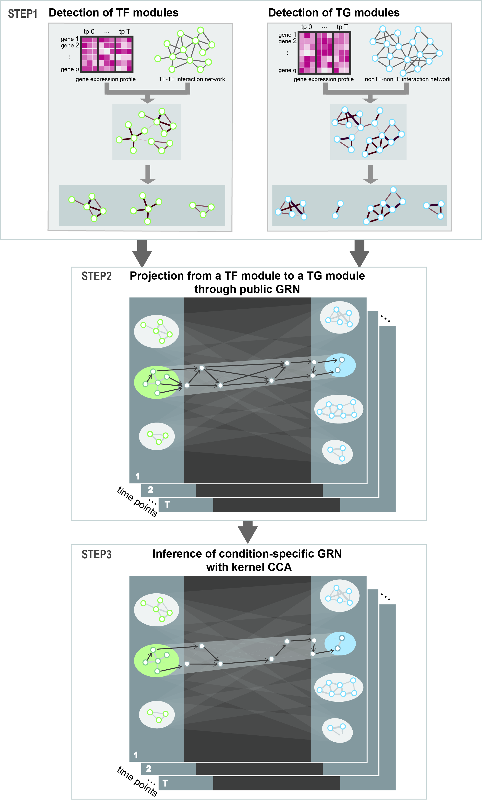

<h1>Construction of Condition-Specific Gene Regulatory Network</h1>

<figure>
	
</figure>

We present a novel computational method to construct **condition-specific transcriptional networks from transcriptome data**. Regulatory interaction between transcription factors (TFs) and target genes (TGs) is very complex, specifically multiple-to-multiple relations. We, therefore, employed kernel CCA to embed TFs and TGs into a new space where the correlation of TFs and TGs are reflected thus identifying multiple-to-multiple TF–TG relations in certain biological condition. 
  
D Jeong <i> et al.</i> <a href="https://www.frontiersin.org/articles/10.3389/fgene.2021.652623/abstract" style="text-decoration:none" hover="text_decoration:underline">Construction of Condition-Specific Gene Regulatory Network using Kernel Canonical Correlation Analysis</a>, Frontiers in Genetics, 2021

---
