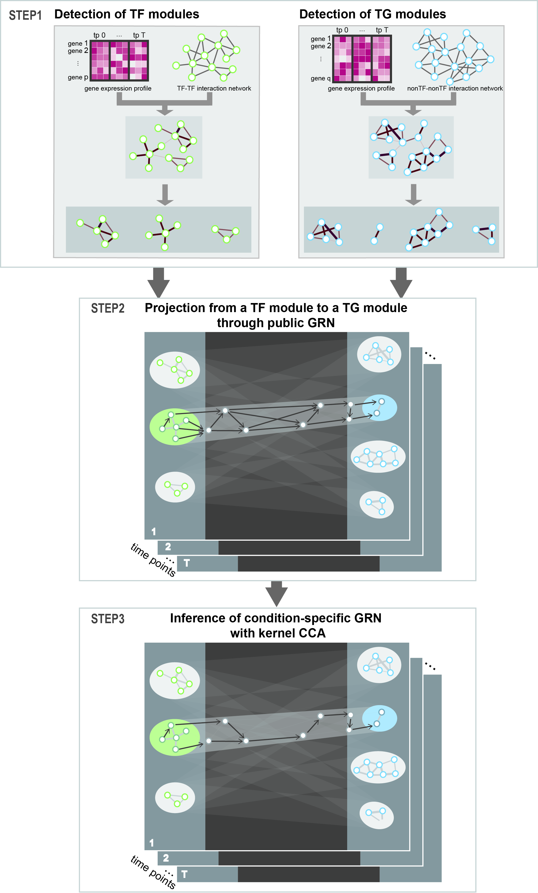

<h1>Construction of Condition-Specific Gene Regulatory Network</h1>

<figure>
	
</figure>

Gene expression profile or transcriptome can represent cellular states, thus understanding gene regulation mechanisms can help understand how cells respond to external stress. Interaction between transcription factor (TF) and target gene (TG) is one of the representative regulatory mechanisms in cells. We present a novel computational method to construct **condition-specific transcriptional networks from transcriptome data**. Regulatory interaction between TFs and TGs is very complex, specifically multiple-to-multiple relations. 
Kernel CCA is a well-established statistical method for computing the correlation of a group of features vs. another group of features. We, therefore, employed kernel CCA to embed TFs and TGs into a new space where the correlation of TFs and TGs are reflected thus identifying multiple-to-multiple TF–TG relations in certain biological condition. 

   
<h3> Reference </h3>
D Jeong <i> et al.</i> <a href="https://www.frontiersin.org/articles/10.3389/fgene.2021.652623/abstract" style="text-decoration:none" hover="text_decoration:underline"><b>Construction of Condition-Specific Gene Regulatory Network using Kernel Canonical Correlation Analysis</b></a>, Frontiers in Genetics, 2021